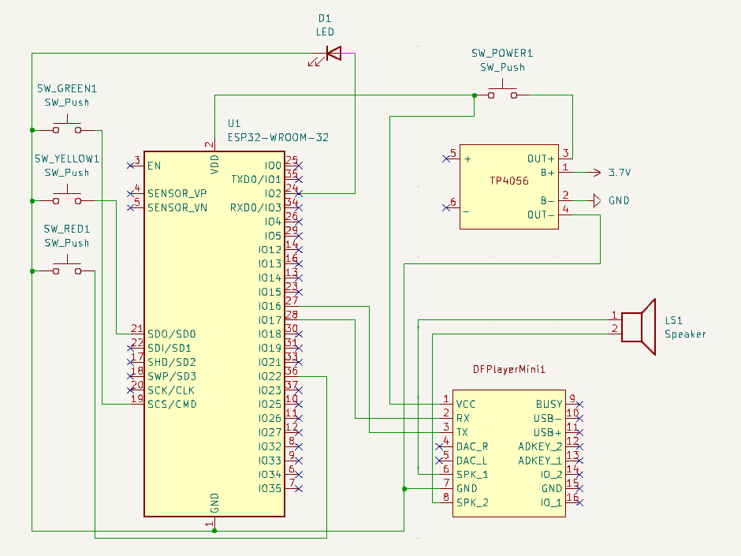
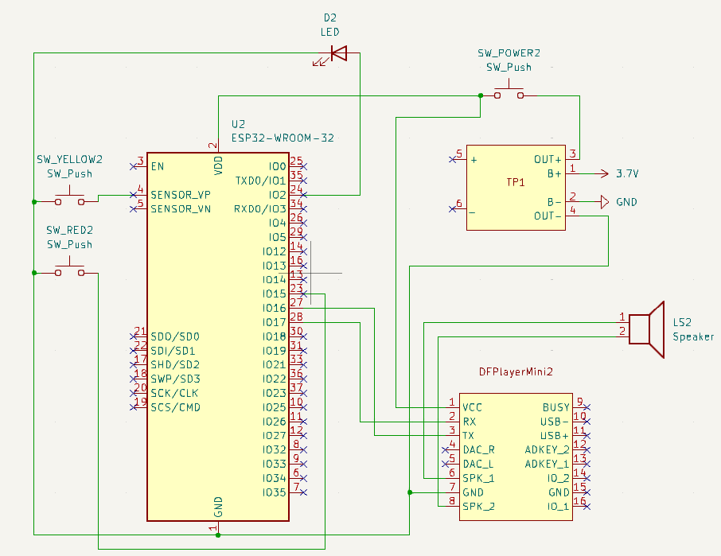

# The Problem

I live in 2-floor house. My room is at the first floor, so anyone who needs my help have to go to my room or scream very loudly. For this reason, I've invented this device.

# The Solution

This is my not the biggest, but the most working project. There are 2 `ESP32`:

- First one has 2 buttons: `Dinner is ready` and `We need help`. This device is located in the kitchen on the ground floor.
- Second one has 3 buttons: `Sorry, but I'm busy`, `I need 5 minutes` and `Alright, I'm going now`.

If someone from my family needs my help or a dinner is ready, they press needed button. ESP32 send this action through `ESP-NOW` protocol to another ESP32 in my room. Then it plays sound using `Mini MP3 DFPlayer`. I have 15 seconds to press a button and return a response.

# Technical details

This is a paragraph for technical details of my project, so you can made your own version.

## Used components:

- `ESP32 WROOM-32 CH340 type-C DEVKIT`. This is the base, foundation, ground of my devices. It's cheap, small and has very useful communications methods.
- `Mini MP3 DFPlayer`. This module stands for user notifications using sound. I've wrote some sounds into 2 SD-cards, that are played depending on the button pressed. It's easy to use it, but there are tons of fake versions that does not work.
- `Li-Po 1200mAh 3.7V 103040-format` battery. It's my first project with battery, so maybe it's not the best variant.
- `TP4056 Type-C` charging module to charge battery and regulate voltage.
- `Buttons`. Just 5 cheap regular buttons I've found in Arduino Starter Kit.
- `Speaker`. I've used just random 8Ohm 1W speaker I've found.

## Wiring:

### Wiring for room device

### Wiring for kitchen device

# Result

# Conclusion

I think this is not wery useful project, but I've learnt tons of new stuff. Code was the easiest part and soldering, at the beginning, was the hardest. I've spent almost all of my winter holidays on it. And I have no regrets.

